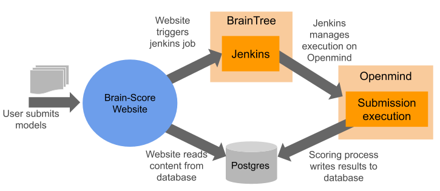

## Submission system

### Components
To provide an automatical scoring mechanism for artificial models of the ventral stream, Brain-Score has implemented a whole system, which is explained in the follows. The system consists of following components:

- **Brain-Score Website:**

    The website implementation, also found on [github](https://github.com/brain-score/brain-score.web), handles user interactions. It is implemented using django and also accesses the database instance.
    When user submit their models in form of a zip file the website triggers the execution with an http request to jenkins, also delivering the submitted zip file.
 
 - **[Jenkins](http://braintree.mit.edu:8080/):**
 
    [Jenkins](http://braintree.mit.edu:8080/) is a continuous integration tool, which we use to automatically run project unittests and the scoring process for brain models.
    Jenkins is running on Braintree, the lab's internal server. Jenkins defines different jobs, executing different taks. The task for a new submission is triggered by the website, the unittest tasks are triggerd by GitHub web hooks.
    Once the jobs are triggered, jenkins runs a procedure to execute the tests or scoring and communicate the results back to the user or back to GitHub. 
-  **Openmind**

      Scoring submissions is a computation and memory expensive process, we cannot execute model scoring on small machines. Because we do not want to execute the jobs on Braintree, we submit jobs to Openmind, the department cluster system.
        The big advantage of Openmind is its queuing system, which allows to define detailed ressource requirements and jobs are executed, once their requested ressources are available. The jenkins related contents are stored on ``/om5/group/dicarlo/jenkins``. 
        This directory contains a script for model submission (`score_model.sh`) and for unittests (`unittests_brainscore.sh`). 
        The scripts are executed in an openmind job and are responsible for fully installing a conda environment, executing the process, shutting everything down again. Results are stored in the database or copied to amazon S3 cloud file system. 
        From there jenkins reports the results back to its caller.
         

- **Postgres database:**

    The database, hosted on amazon AWS, contains all displayed score and submission data. The amazon instance contains three database instances:
     - Prod (`brainscore-prod-ohio-cred`): This database is used in production mode, containing real user's data. This database should not be altered for development.
     - Dev (`brainscore-1-ohio-cred`): A development database, which can be used to develop new database dependent features. Nothing will break when the database schema here is changed.
     - Test (`brainscore-ohio-test`): The database used for executing tests. Jenkins also executes unittests of all brain-score projects and should use this database for testing.
    
    The names in brackets are used in brain-score to load database credentials for the different databases. Just change the name and another database is used.

        
####What to do...
### ...when changing the database schema
The current schema is depicted [here](db_schema.uml)
When the database schema has to be changed, use `brain-score.web` project and django commands to adjust the tables (in `benchmarl/models.py`). When your changes ar ready, migrate to the postgres databases (dev/test and later prod).
During development, work with the dev database (secret `brainscore-1-ohio-cred`), when your tests pass on the test database (`brainscore-ohio-test`) they are ready for the PR. Once the PR is approved and test cases run, the PR can be merged and the database schema has also be migrated to the prod database. 
**Don't forget to migrate to the prod database when your code is merged!**

### ...changing the submission process
In addition to the main job for scoring submission `run_benchmarks` jenkins contains a second job `dev_run_benchmarks`, which can be used to test new submission code. It is also a good idea instead of checking out the brain-score master branch, as it is done in the default job, to checkout your development branch instead. This way you can run a whole submission without harming the "production" job. To do so, copy the `score_model.sh` script to `dev_score_model.sh` on Openmind and adjust it as you need it.
Once the development job runs successful the code can be merged to master and will be run "in production". If you applied changes to the Openmind script or the dev jenkins job, don't forget to migrate them back to the base script.
 
##Scoring process description
For scoring submitted files, we install the Brain-Score framework on Opemnind and run the scoring process. There are two types of submissions possible:
- First time submissions, submitting a zip file with new models to score. 
- Resubmission of already scored models, which should be scored on updated/new benchmarks . To do so only a list of model id's as stored in the database are required.
For new submissions the delivered zip file is unpacked, the modules installed and models instantiated. The submitted modules must implement a clearly defined API, which is described in detail in a [sample project](https://github.com/brain-score/sample-model-submission).
When the submitted module is correct, the process can extract the models and score them. The API differs, depending on the type of model (either BaseModel or BrainModel) and stores produced results in the Score table and in a csv file. 
When old models should be scored on new benchmarks, the process installs (possibly multiple) past submission zip files and scores the models. Every submission and all scores are persisted in the database. Scores are also written to a .csv file. This file is reported back to the submittor.  
