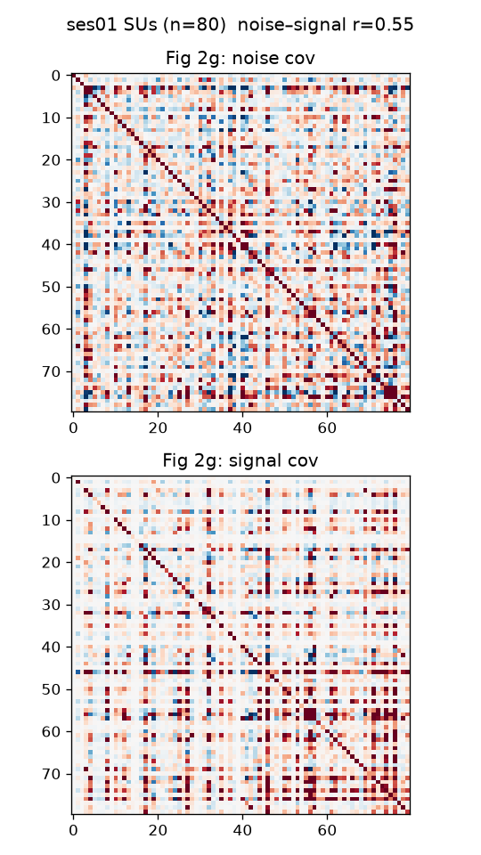

# Li2026 (Triple-N) packaging validation

`li2026_validation.ipynb` checks that the packaged assemblies faithfully reproduce
the source dataset by independently regenerating figures from Li, Bao et al.,
*Nature Neuroscience* 2026 (doi:10.1038/s41593-026-02322-z). It uses only the raw
data, `torchvision`, and `scikit-learn` — no `brainscore_vision` — so it is an
independent check rather than a self-test.

Two things are validated:

- **Data packaging** — dataset-statistics figures (1f, 2f, 2g, 3d, 3e) reproduce only
  if responses, region/patch labels, per-image PSTHs, and stimulus alignment are correct.
- **Encoding methodology** — the AlexNet-vs-MPNet result reproduces the paper's finding
  that visual features predict macaque IT better than semantic features (LVR < 1).

## Running it

Inputs are read from `$VAL_DATA` (default `/home/ec2-user/val`); figures are written to
`$VAL_OUT`. Stage the following into `$VAL_DATA`:

| File | Used for |
| --- | --- |
| `Processed/Processed_ses*.mat`, `exclude_area.xls` | per-unit table (1f, 2f) |
| `GoodUnit_ses01.mat` | example-session covariance (2g) |
| `Li2026_temporal_assembly.nc` | per-image PSTHs (3d, 3e) |
| `Li2026_stimulus_set.csv`, `stimuli/`, `nsd_stim_info_merged.csv`, `captions_*.json` | encoding (5) |

The temporal assembly and stimulus set come from `build_li2026_temporal.py` /
`build_li2026_static.py` in the parent directory.

## Results vs. the paper

| Figure | Reproduced | Paper | Verdict |
| --- | --- | --- | --- |
| **1f** reliable-unit counts | V1 2556 / V2 2625 / V4 3559 / IT 26,700 | matches Fig 1 counts | exact |
| **2f** cross-area similarity | within-category r 0.38 vs cross-category 0.02 | strong within-category blocks | match |
| **2g** noise vs signal covariance | corr 0.55 (positive) | example ~0.44 | same regime |
| **3d** response-type clusters | V1/V2/V4 ~0.82–0.95 fast-transient; IT later/sustained (0.17/0.53/0.30) | region-differentiated types | match |
| **3e** population RSA over time | near-diagonal 0.89 to early-vs-late 0.26 | structured temporal evolution | match |
| **5** AlexNet vs MPNet encoding | AlexNet IT 0.33 > MPNet IT 0.24; LVR 0.93 | LVR 0.74 (visual > semantic) | directional match |

The Fig 5 LVR magnitude differs (0.93 vs 0.74) because this notebook uses a single
AlexNet FC6 layer with a fixed PLS dimensionality, whereas the paper selects the
optimal PCA/PLS components; the direction (visual > semantic) is what reproduces.

The `1f` median in `figs/validation_summary.json` reads `NaN` for regions containing
units with undefined reliability (the executed run used `np.median`, not `nanmedian`);
this is cosmetic — the reliable-unit counts and the boxplot are correct, and the
benchmark's ceiling uses `nanmedian`.

## Figures

### Fig 1f — split-half reliability by region

### Fig 2f — cross-area similarity

### Fig 2g — noise and signal covariance (example session)

### Fig 3d — response-type clusters by region

### Fig 3e — population RSA across time

### Fig 5 — AlexNet (FC6) and MPNet encoding accuracy

