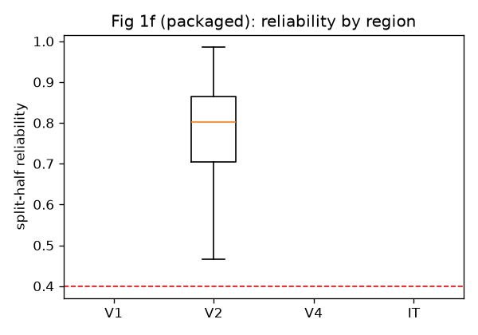
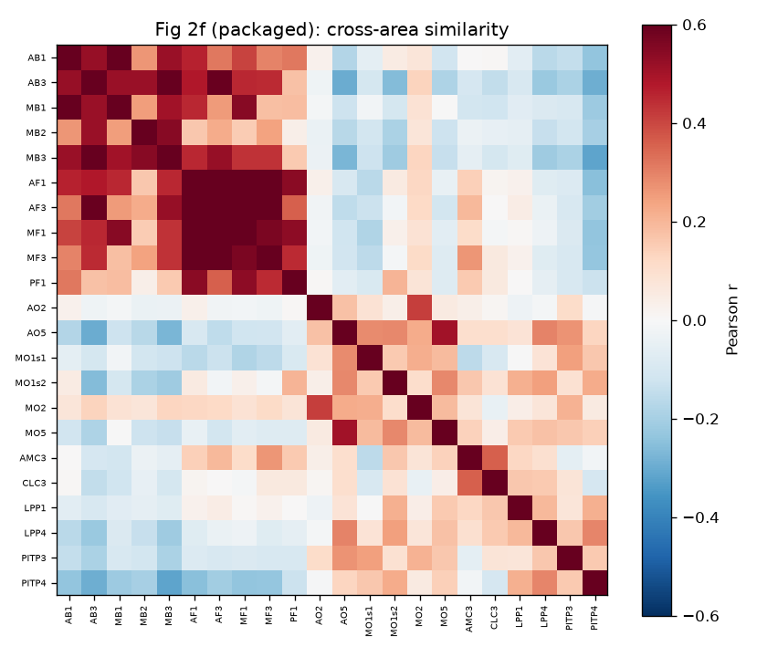
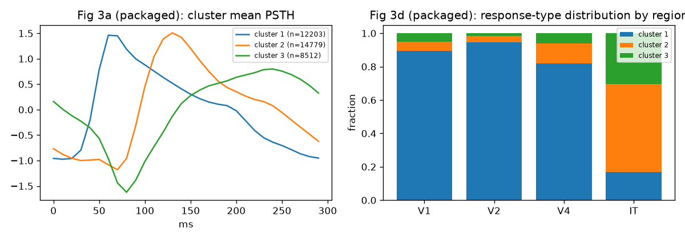
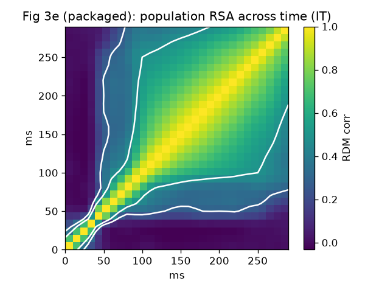
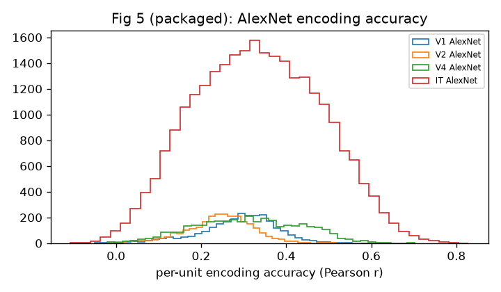

# Li2026 (Triple-N) packaging validation

`li2026_validation.ipynb` checks that the **packaged** assemblies reproduce figures from
Li, Bao et al., *Nature Neuroscience* 2026 (doi:10.1038/s41593-026-02322-z). Every figure
is regenerated from the Brain-Score data API -- `load_dataset('Li2026')`,
`load_dataset('Li2026.temporal')`, and `load_stimulus_set('Li2026')` -- i.e. the assemblies
served from S3, not the raw `.mat` files.

Reproducing the paper's figures from these proves two things at once:

- the **packaging round-trip is lossless** (the S3 assemblies carry the same response values
  as the source), and
- the assembly carries **enough metadata** (region, patch label, reliability, time bins,
  stimulus links) to support the dataset's own analyses.

## Running it

The packaged data is fetched by `brainscore_vision` (credentialed S3 read). The only external
input is COCO captions for the MPNet semantic baseline, linked to stimuli via the `coco_id`
column of the packaged stimulus set; stage `captions_train2017.json` / `captions_val2017.json`
into `$VAL_DATA`. Figures are written to `$VAL_OUT`. Single-threaded BLAS is set at the top of
the notebook (`OMP_NUM_THREADS=1`, `torch.set_num_threads(1)`) to avoid an OpenBLAS/nbconvert
deadlock on the large IT regression.

## Results vs. the paper

| Figure | Reproduced (from packaged data) | Paper | Verdict |
| --- | --- | --- | --- |
| **1f** reliability by region | IT median 0.60, V1/V2/V4 0.70/0.80/0.80; reliable counts V1 2556 / V2 2625 / V4 3559 / IT 26,700 | matches Fig 1 (IT median ~0.6) | exact counts |
| **2f** cross-area similarity | within-category r 0.38 vs cross-category 0.02 (22 patches) | strong within-category blocks | match |
| **3d** response-type clusters | V1/V2/V4 ~0.82-0.95 fast-transient; IT later/sustained (0.17/0.53/0.30) | region-differentiated types | match |
| **3e** population RSA over time | near-diagonal 0.89 to early-vs-late 0.26 | structured temporal evolution | match |
| **5** AlexNet vs MPNet encoding | AlexNet IT 0.33 > MPNet IT 0.24; LVR 0.93 | LVR 0.74 (visual > semantic) | directional match |

The Fig 5 LVR magnitude differs (0.93 vs 0.74) because this notebook uses a single AlexNet
FC6 layer with a fixed PLS dimensionality, whereas the paper selects the optimal PCA/PLS
components; the direction (visual > semantic) is what reproduces.

Fig 2g (trial-noise vs signal covariance) is intentionally not reproduced: it requires
trial-resolved data, which this package does not carry (responses are trial-averaged). That is
a deliberate boundary of the packaged metadata, not a packaging error.

## Figures

### Fig 1f -- split-half reliability by region

### Fig 2f -- cross-area similarity

### Fig 3d -- response-type clusters by region

### Fig 3e -- population RSA across time

### Fig 5 -- AlexNet (FC6) and MPNet encoding accuracy

