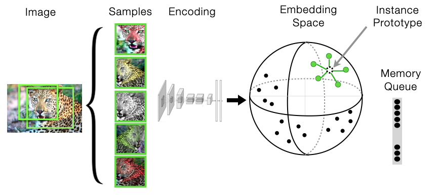

# open_ipcl
 PyTorch implementation and pretrained models for IPCL (instance-prototype contrastive learning). For details see **Beyond category-supervision: Computational support for domain-general pressures guiding human visual system representation** [[bioRxiv]](https://www.biorxiv.org/content/10.1101/2020.06.15.153247v3)

<p align="center">
  
</p>

```
@article{konkle2021beyond,
  title={Beyond category-supervision: Computational support for domain-general pressures guiding human visual system representation},
  author={Konkle, Talia and Alvarez, George A},
  journal={bioRxiv},
  year={2021},
  publisher={Cold Spring Harbor Laboratory}
}
```

## System Requirements
This code has been tested with python=3.6, and PyTorch v1.7 and 1.9. See conda_env.ipynb for notes on environment setup, or use the environment.yml file to install a new conda environment with all dependencies.

## Load Pretrained Models with torch.hub

Models are numbered to align with Supplementary Table 1 in our paper [bioRxiv](https://www.biorxiv.org/content/10.1101/2021.05.28.446118v1.full). 

load an AlexnetGN model trained on imagenet with IPCL:
```
import torch
model, transform = torch.hub.load("harvard-visionlab/open_ipcl", "alexnetgn_ipcl_ref01")
```

load one of several IPCL replications, with variations in code-base and training recipe (these variations had little impact on linear readout, or fit to neural responses):
```
import torch
model, transform = torch.hub.load("harvard-visionlab/open_ipcl", "alexnetgn_ipcl_ref02")
model, transform = torch.hub.load("harvard-visionlab/open_ipcl", "alexnetgn_ipcl_ref03")
model, transform = torch.hub.load("harvard-visionlab/open_ipcl", "alexnetgn_ipcl_ref04")
model, transform = torch.hub.load("harvard-visionlab/open_ipcl", "alexnetgn_ipcl_ref05")
```

We trained IPCL models on different datasets. All of these models were trained with a less extreme random-resized-crop range (to prevent cropping faces too closely, and to allow a fair comparison acroos all datasets). These models generally performed less well on imagenet linear classification:
```
import torch
model, transform = torch.hub.load("harvard-visionlab/open_ipcl", "alexnetgn_ipcl_ref06_diet_imagenet")
model, transform = torch.hub.load("harvard-visionlab/open_ipcl", "alexnetgn_ipcl_ref07_diet_openimagesv6")
model, transform = torch.hub.load("harvard-visionlab/open_ipcl", "alexnetgn_ipcl_ref08_diet_places2")
model, transform = torch.hub.load("harvard-visionlab/open_ipcl", "alexnetgn_ipcl_ref09_diet_vggface2")
model, transform = torch.hub.load("harvard-visionlab/open_ipcl", "alexnetgn_ipcl_ref10_diet_FacesPlacesObjects1281167")
model, transform = torch.hub.load("harvard-visionlab/open_ipcl", "alexnetgn_ipcl_ref11_diet_FacesPlacesObjects1281167x3")
```

We trained several category-supervised models for direct comparison to our IPCL models.  
trained on imagent with 5 samples per image (like IPCL), using same augmentsions as IPCL models 1-5:
```
import torch
model, transform = torch.hub.load("harvard-visionlab/open_ipcl", "alexnetgn_supervised_ref12_augset1_5x")
```

or a single sample per image (as is standard), using same augmentsions as IPCL models 1-5:
```
import torch
model, transform = torch.hub.load("harvard-visionlab/open_ipcl", "alexnetgn_supervised_ref13_augset1_1x")
```

Finally, two category-supervised models trained on imagenet, using the augmentations used in our visual-diet manipulation (IPCL models 6-11):
```
import torch
model, transform = torch.hub.load("harvard-visionlab/open_ipcl", "alexnetgn_supervised_ref14_augset2")
model, transform = torch.hub.load("harvard-visionlab/open_ipcl", "alexnetgn_supervised_ref15_augset2_rep1")
```

## Load Pretrained Models from cloned repo

Models are numbered to align with Supplementary Table 1 in our paper [bioRxiv](https://www.biorxiv.org/content/10.1101/2021.05.28.446118v1.full). For example, to load a self-supervised model, trained with IPCL:

```
import models
model, transform = models.__dict__['ipcl1']()

```

The transform returned here should be used when getting activations for test images, which in our case were
stimuli from a neuroimaging experiment. For these test images, standard validation transforms (e.g., those used
in knn_eval.py or main_lincls_onecycle.py) would crop out details of the object depicted. The transform returned above
resizes to 224 pixels, then center crops (as opposed to resizing to 256 pixels followed by a center crop).

```
Compose(
    Resize(size=224, interpolation=PIL.Image.BILINEAR)
    CenterCrop(size=(224, 224))
    ToTensor()
    Normalize(mean=[0.485, 0.456, 0.406], std=[0.229, 0.224, 0.225])
)
```

## Get Activations

To get the activations for any model layer, you can use the FeatureExtractor class. 

```
from PIL import Image
from lib.feature_extractor import FeatureExtractor

# load an image
img = Image.open('./images/cheetah.jpg')

# transform and add batch dimension
img = transform(img).unsqueeze(0)

# get features from fc7
model.eval()
with FeatureExtractor(model, 'fc7') as extractor:
    features = extractor(img)
    for name,val in features.items():
        print(name, val.shape)
        
# get features from fc7, fc8, and l2norm layers
model.eval()
with FeatureExtractor(model, ['fc7','fc8','l2norm']) as extractor:
    features = extractor(img)
    for name,val in features.items():
        print(name, val.shape)
        
# get features from conv_block1.0, conv_block1.1, conv_block1.2
model.eval()
with FeatureExtractor(model, ['conv_block_1.0','conv_block_1.1','conv_block_1.2']) as extractor:
    features = extractor(img)
    for name,val in features.items():
        print(name, val.shape)        
        
```        

## KNN Evaluation

knn_eval.py Can be used to estimate KNN classification accuracy based on model activations. Just specifiy the model_name (e.g., 'ipcl1'), the layer to be readout (e.g., 'l2norm'), and the path to the imagenet dataset:
```
CUDA_VISIBLE_DEVICES='0' python knn_eval.py ipcl1 l2norm --data_dir /path/to/imagenet
```

## Linear Evaluation (10 epochs)

We adapted the standard linear evaluation protocol to use a one-cycle learning rate policy, enabling us to estimate linear evaluation accuracy in 10 epochs (as opposed to 100 in the standard protocol.). Just specifiy the model_name (e.g., 'ipcl1'), the layer to be readout (e.g., 'fc7'), and the path to the imagenet dataset:
```
CUDA_VISIBLE_DEVICES='0' python main_lincls_onecycle.py ipcl1 fc7 --data /path/to/imagenet --gpu 0
```


## Train Models
Our original training code was based on https://github.com/zhirongw/lemniscate.pytorch, but the IPCL models were slow to train (~21 days on a single Titan X Pascal). The same code runs faster on newer gpus (e.g., ~7 days on a Tesla V100), but is included here only for reference. For updated code and faster model training use train_ipcl.py (see below).

***replicate original ipcl_alexnet_gn model (warning could be slow, unless you have a Tesla V100)***
```
python train_original.py --data /path/to/imagenet
```

We found the primary bottleneck for training these models was the fact that IPCL augments each image N times (N=5 in our experiments), so we implemented custom transforms that perform augmentations on the GPU. These models train almost twice as fast (~11 days on a single Titan X Pascal gpu; ~4 days on a Tesla V100), and perform as well on imagenet classification (we have not tested these newer models for correspondence with neural responses).

***train ipcl_alexnet_gn with faster augmentations (faster training, equally performant models)***
```
python train_ipcl.py -a alexnet_gn /path/to/imagenet
```

### License

This project is released under MIT License, which allows commercial use. See [LICENSE](LICENSE) for details.
